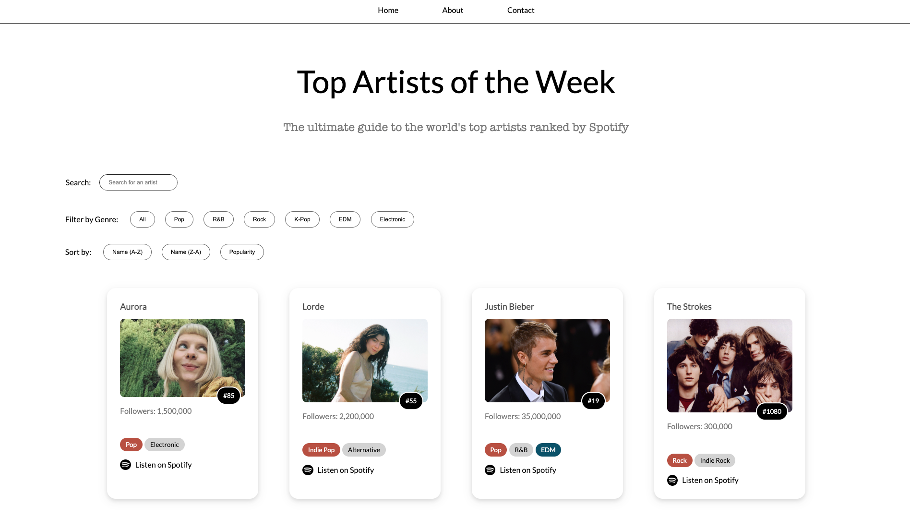

# 🎵 Rankify — Top Artists of the Week

**Rankify** is an interactive catalog web app that showcases the world's top artists based on Spotify rankings. Designed for the Snap Engineering Academy challenge, this project allows users to browse, search, filter, and sort through global music sensations by genre, name, and popularity.



Try it out live: [Live demo](https://gsujaritchai-sea.netlify.app)

## 🌟 Features

- 🔍 **Search** for artists by name
- 🎧 **Filter** by music genre: Pop, R&B, Rock, K-Pop, EDM, Electronic
- 📈 **Sort** alphabetically or by popularity
- 🧑‍🎤 **Display** artist cards with image, followers, and ranking
- 🎨 Responsive and minimalistic UI design using custom CSS

## 🛠️ Tech Stack

- **HTML5** – Page structure
- **CSS3** – Custom styling
- **JavaScript** – DOM manipulation and dynamic filtering logic

## 💡 Inspiration

This project was built as part of the Snap Engineering Academy's challenge to create a personalized catalog. As a music lover, I wanted to build a data-driven but user-friendly interface to highlight trending artists globally.

## 🚀 Getting Started

To run Rankify locally:

1. Clone the repo:

   ```bash
   git clone https://github.com/TamSuj/Rankify.git
   cd Rankify
    ```

2. Open `index.html` in your web browser.